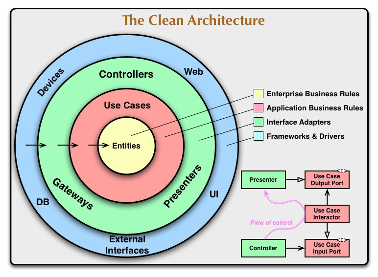

  
  

 

# Expense Tracker - daily Expense Monitor

 

 
 

 

## OVERVIEW

Often times we forget how/where we spent our money. If the transaction is in the form of digital *(UPI, Netbanking, Debit/ Credit cards)* checking the Bank statement may help sometime but not all the time. Also, there are certain situations where we spent in the form of *cash*, which in turn make it harder to remember all our cash transactions. This where Expense Tracker comes in handy.

**Expense Tracker** is a modern android application that keeps track of all our daily transactions. The application helps to manage your cashflow and also provides a visual representation of your transactions.

Every time you make a transaction, spent a maximum of ***5 seconds*** to save the transaction details and that's it, **Expense tracker** will remember that transaction for you.

***

## DESIGN PATTERN
**Expense Tracker** uses ***clean architecture*** design pattern, which allows separating the ***user interface logic*** from the ***business(*backend*) logic***.

  
  

 

This application is split into three layers as described below:
1. **Domain** : contains the implementation of the *business logic of the app, the server data model, the abstract definition of repositories, and the use cases*.
2. **Data** : contains the implementation of the ***abstract definitions*** of the domain layer. It contains *repositories and data sources implementations, the database definition with its DAOs, the network APIs definitions, some mappers to convert network API models to database models, and vice versa*.
3. **Presentation** : contains all *UI related stuffs like activities, fragments, view models and so on*.

***

## LIBRARIES

1. **Jetpack Compose** - Modern *UI toolkit* for Android
2. **Compose Navigation** - For navigating between different screens
2. **Lifecycle Viewmodel** -  For surviving configuration changes.
2. **Room** - For storing transactions in local database.
3. **Retrofit** - For making network calls.
4. **Kotlinx - Serialization** - For *serializing and deserializing* kotlin objects.
5. **Datastore Preferences** - For *stroring and retriving* user data.
6. **Hilt** - For dependency injection
7. **Coil** - For *image loading* and displaying.
8. **Coroutines** - Asynchronously handle server and local database requests.
8. **Accompanist** 
	+ **Navigation Animation** - To animate navigation from one screen to another.
	+ **Horizontal Pager and Indicator** - For onboarding screens
	+ **Swipe To Refresh** - For implementing swipe to refresh functionality
	+ **System UI Controller** - For changing system bar colors
	
---
	

## FEATURES
1. *Visualize monthwise income and expense.*
2. *Swipe to delete the transactions*
3. *Add your own transaction category*
4. *Visualize the overall transaction and also get total income percentage*
5. *High and Low transaction details*
6. *Automatic login*

---

## REQUEST
* **Found a bug?** report it creating an issue.
* **Wish to contribute to this project?** please do create a fork and do a pull request with the new features.

---

## CONTACT

---

 

❤️ **Happy Coding!!** ❤️

